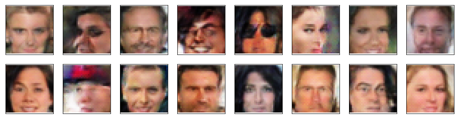
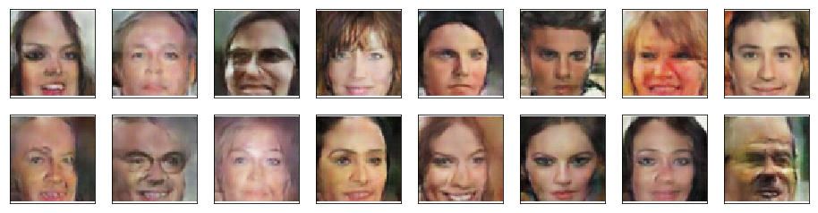

# Face Generation using DCGAN

In this project, I define and train a DCGAN on a dataset of faces in order to get a generator network to generate new images of faces that look as realistic as possible!

## Installation

Download and run the notebook "dlnd_face_generation.ipynb" (PyTorch).
The model is trained using pre-processed CelebA dataset of faces (64x64x3 images). The Generator is trained to generate 32x32 RGB faces.

The dataset can be downloaded from https://s3.amazonaws.com/video.udacity-data.com/topher/2018/November/5be7eb6f_processed-celeba-small/processed-celeba-small.zip.

## Variant

The alternative notebook "dlnd_face_generation-64x64.ipynb" comes as a variant generating 64x64 RGB faces. It uses the same dataset and resources.

## Content

- Get and pre-process data
- Create DataLoader
- Define the model:
  - Discriminator
  - Generator
  - Initialize weigths
  - Build complete network
- Define Discriminator and Generator losses
- Define Optimizers
- Train the model
- Generate samples from training

## Training

The training was done on GPU which is recommended.

## Results

32x32 samples:

64x64 samples:

